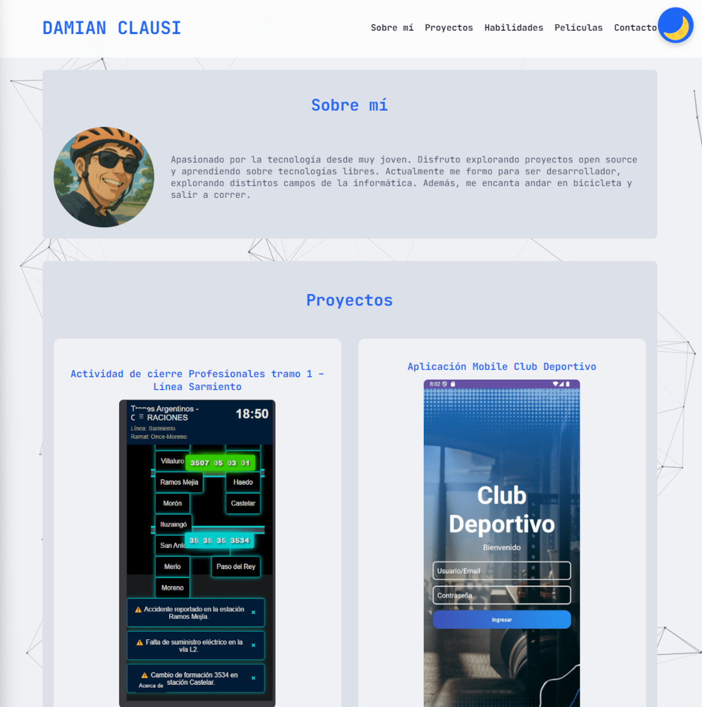

# 🎓 IFTS 29 - Tecnicatura en Desarrollo de Software  

# 💻 Desarrollo de Sistemas Web Frontend

---

# 📄 PFO2 - Landing Page Interactiva

Este proyecto es una mejora de la landing page desarrollada en la PFO1. En esta segunda etapa se incorporarán **funcionalidades interactivas con JavaScript** y se aplicarán **mejoras en el diseño y la estructura** del sitio.

---

👤 **Alumno:** Damián Clausi  
🧑‍🏫 **Profesor:** Luciano Martinez  
📚 **Comisión:** D  

---

## 🧠 Funcionalidades con JavaScript

Se implementarán las siguientes 5 funcionalidades con JavaScript:

1. **Modo Oscuro/Claro**
   - **Un botón permite alternar entre el modo claro y oscuro**:  
   - ✅ *Aporta accesibilidad y personalización visual.*
   ✅ *Basado en la paleta de colores de [Catppuccin](https://catppuccin.com/), usando el tema* `Mocha` *para modo oscuro y* `Latte` *para modo claro.*


2. **[Nombre de la funcionalidad 2]**
   - **Descripción**:  
   - ✅ *Justificación:*

3. **[Nombre de la funcionalidad 3]**
   - **Descripción**:  
   - ✅ *Justificación:*

4. **[Nombre de la funcionalidad 4]**
   - **Descripción**:  
   - ✅ *Justificación:*

5. **[Nombre de la funcionalidad 5]**
   - **Descripción**:  
   - ✅ *Justificación:*

---

## 🎨 Mejoras en el diseño y estructura

Se aplicarán al menos dos mejoras estructurales o estéticas respecto a la PFO1:

1. **[Descripción de mejora 1]**
   - ✅ *Justificación:*

2. **[Descripción de mejora 2]**
   - ✅ *Justificación:*

---

### 📸 Captura comparativa

| Antes (PFO1) | Después (PFO2) |
|--------------|----------------|
|  |  |


---

## 🚀 Cómo ver el proyecto

- **Repositorio**: [GitHub - portfoliopersonal-pfo2](https://github.com/damianclausi/portfoliopersonal-pfo2)
- **Sitio en vivo**: [GitHub Pages](https://damianclausi.github.io/portfoliopersonal-pfo2/)

---

## 📁 Estructura de carpetas

```
portfoliopersonal-pfo2/
├── index.html
├── css/
│   └── styles.css
├── img/
│   ├── captura-pfo2.png
│   └── ...
├── js/
│   └── main.js
└── README.md
```

---

